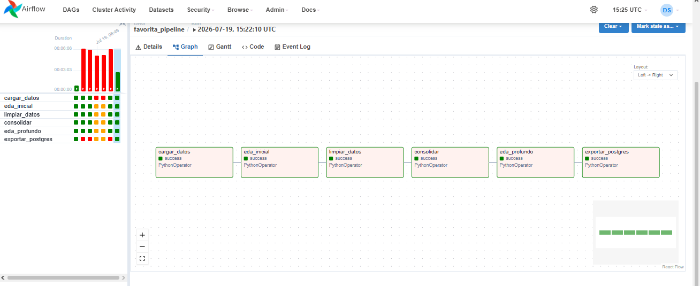
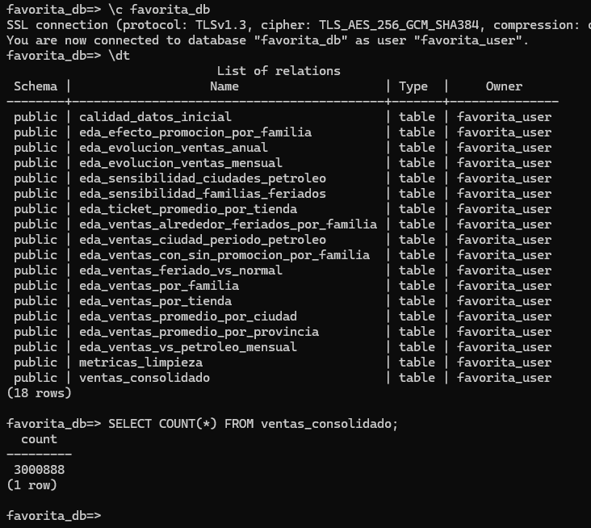
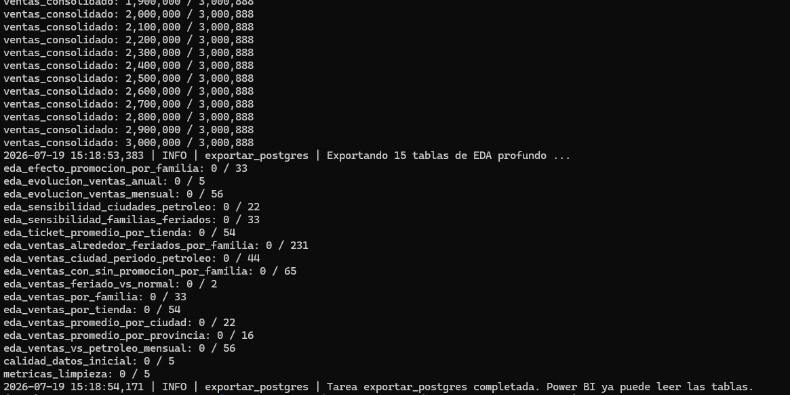
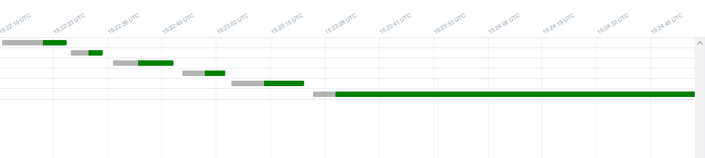

# Pipeline ETL Corporación Favorita

## 1. Descripción del proyecto

Pipeline ETL desarrollado para el procesamiento y análisis de datos de ventas de Corporación Favorita.

El proyecto implementa un flujo automatizado utilizando Apache Airflow como herramienta de orquestación y Polars como motor principal para la transformación eficiente de grandes volúmenes de datos.

El pipeline permite realizar la extracción de datos desde archivos CSV, limpieza y transformación de información, consolidación en formato Parquet, generación de análisis exploratorio y exportación hacia PostgreSQL para su consumo mediante herramientas de Business Intelligence como Power BI.

---

## 2. Tecnologías utilizadas

| Tecnología | Uso |
|---|---|
| Python | Desarrollo del pipeline ETL |
| Apache Airflow 2.10.5 | Orquestación y ejecución automática |
| Polars | Limpieza y transformación de datos |
| Pandas / NumPy | Análisis complementario |
| PyArrow | Manejo de archivos Parquet |
| PostgreSQL | Almacenamiento analítico |
| Power BI | Visualización de resultados |

---

## 3. Arquitectura de la solución

```text
Dataset CSV
     |
     v
Apache Airflow
     |
     v
DAG favorita_pipeline
     |
     +----------------+
     |                |
     v                v
Carga datos     Limpieza Polars
     |                |
     +----------------+
             |
             v
Consolidación Parquet
             |
             v
Análisis Exploratorio
             |
             v
PostgreSQL
             |
             v
Power BI

---

## 4. Descripción del DAG

Archivo principal:

```text
dags/favorita_pipeline.py
```

Nombre del DAG:

```text
favorita_pipeline
```

### Tareas ejecutadas

| Tarea             | Descripción                                        |
| ----------------- | -------------------------------------------------- |
| cargar_datos      | Lectura de archivos CSV                            |
| eda_inicial       | Análisis inicial y calidad de datos                |
| limpiar_datos     | Tratamiento de valores faltantes e inconsistencias |
| consolidar        | Unión de datasets y generación Parquet             |
| eda_profundo      | Creación de tablas analíticas                      |
| exportar_postgres | Carga final hacia PostgreSQL                       |

### Dependencias

```text
cargar_datos
      |
      v
eda_inicial
      |
      v
limpiar_datos
      |
      v
consolidar
      |
      v
eda_profundo
      |
      v
exportar_postgres
```

### Configuración

* PythonOperator para ejecutar scripts.
* Variables de configuración mediante archivos Python.
* PostgreSQL como almacenamiento final.
* Archivos Parquet como formato intermedio optimizado.

---

## 5. Proceso del pipeline

### Etapa 1: Carga de datos

Archivos utilizados:

* train.csv
* test.csv
* stores.csv
* transactions.csv
* oil.csv
* holidays_events.csv

Los datos son cargados y preparados para el procesamiento.

---

### Etapa 2: Análisis exploratorio inicial

Se generan métricas iniciales:

* cantidad de registros;
* tipos de datos;
* valores nulos;
* estadísticas generales.

Captura del DAG ejecutándose:



---

### Etapa 3: Limpieza de datos

Proceso realizado mediante Polars:

* tratamiento de valores faltantes;
* conversión de tipos;
* eliminación de inconsistencias;
* preparación de datasets limpios.

---

### Etapa 4: Consolidación

Se integran:

* ventas;
* tiendas;
* transacciones;
* petróleo;
* feriados.

Resultado almacenado en formato Parquet.

---

### Etapa 5: Análisis exploratorio profundo

Se generan tablas analíticas:

* evolución de ventas;
* ventas por tienda;
* ventas por familia;
* efecto de promociones;
* impacto de feriados;
* relación con precio del petróleo.

---

### Etapa 6: Exportación PostgreSQL

Los datos consolidados son enviados hacia PostgreSQL.

Capturas:





---

## 6. Métricas del pipeline

### Registros procesados

| Dataset             | Registros |
| ------------------- | --------: |
| train.csv           | 3,000,888 |
| stores.csv          |        54 |
| transactions.csv    |    83,488 |
| oil.csv             |     1,218 |
| holidays_events.csv |       350 |

### Tiempo de ejecución Airflow



---

## 7. Dashboard Power BI

El resultado del pipeline será utilizado para construir dashboards analíticos.

Indicadores:

* evolución de ventas;
* ventas por tienda;
* ventas por familia;
* impacto de promociones;
* comportamiento según feriados;
* análisis económico relacionado con petróleo.

Capturas serán agregadas posteriormente por el equipo encargado.

---

## 8. Despliegue del proyecto

### Requisitos

* Python 3.12
* Apache Airflow 2.10.5
* PostgreSQL
* Entorno virtual Python

### Instalación

Crear entorno virtual:

```bash
python3 -m venv venv
```

Activar:

```bash
source venv/bin/activate
```

Instalar dependencias:

```bash
pip install -r requirements.txt
```

Ejecutar Airflow:

Terminal 1:

```bash
airflow webserver
```

Terminal 2:

```bash
airflow scheduler
```

Ejecutar DAG:

```bash
airflow dags trigger favorita_pipeline
```

---

## 9. Estructura del proyecto

```text
ProyectoAnalisis/

├── dags/
│   └── favorita_pipeline.py

├── scripts/
│   ├── 01_cargar_datos.py
│   ├── 02_eda_inicial.py
│   ├── 03_limpiar_datos.py
│   ├── 04_consolidar.py
│   ├── 05_eda_profundo.py
│   ├── 06_exportar_postgres.py
│   └── config.py

├── capturas/
│   ├── 01_graph.png
│   ├── 02_gantt.png
│   ├── 03_tablas_postgres.png
│   └── 04_exportacion.png

├── requirements.txt
├── manifest.json
└── README.md
```

---

## Autores

* Damian Cadavid
* Danny Salcedo
* Dereck Ortiz

Proyecto académico - Pipeline ETL Corporación Favorita

